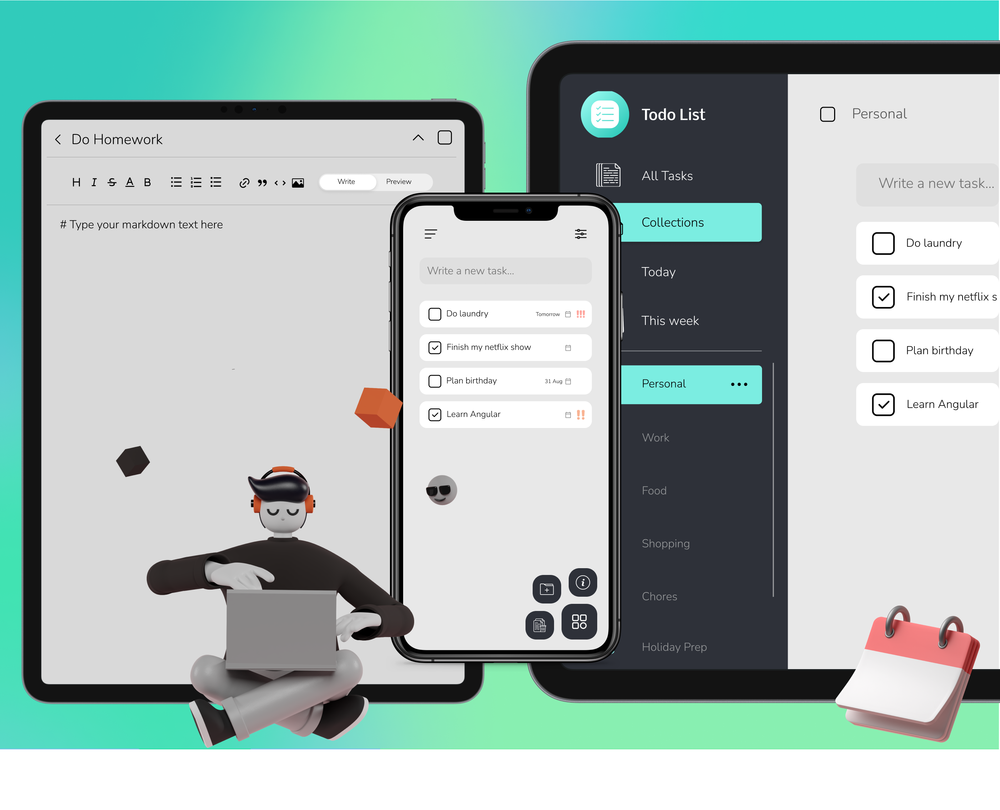

# TodoList

This project is a simple to-do list app I made when learning Angular.

Check out the project live [here](https://bisxsh.github.io/angular-todo-list/)!

Check out the design file [here](https://www.figma.com/file/GQTxnhir2TgDUJDulqsMWV/Todo-list?node-id=0%3A1)!

Currently missing features: User onboarding, design responsiveness (currently built for 1920x1080), animations

### Design

